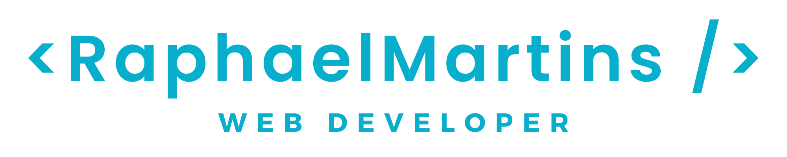
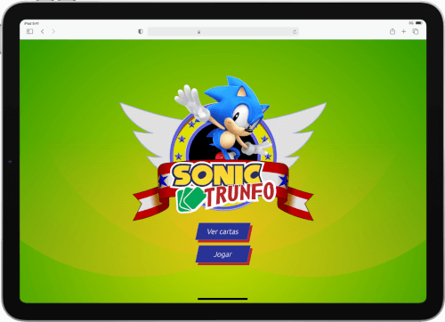
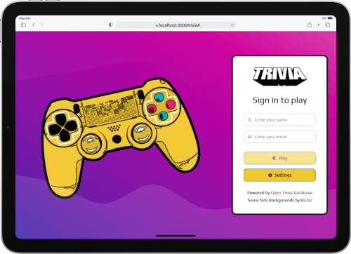
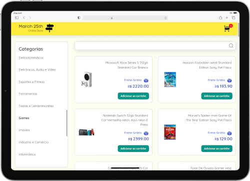
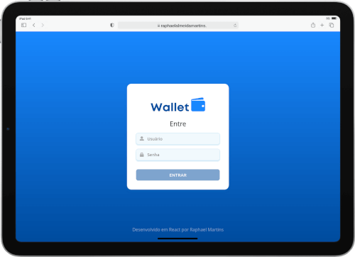

```JavaScript
const aboutMe = {
  name: 'Raphael Martins',
  age: '27 years old';
  level: 'Junior',
  tools: ['HTML', 'CSS', 'JavaScript ES6+', 'Sass', 'React', 'Redux', 'RTL'],
  softSkills: [
    'creativity',
    'leadership',
    'organization'
  ]
};

function contatcMe() {
  return 'Linkedin: https://www.linkedin.com/in/raphaelameidamartins/';
}
```
<br>
:us:
<p>Web Developer in the making. Currently, I am finishing the Back-end module of Trybe's course. I am a 27-year-old Brazilian who lives in São Paulo, Brazil. A nerd boy who loves technology, pop music, comic books, and games. I am a very creative person who likes to take on challenges and solve problems. Likewise, I am also dedicated and passionate about the things I do.</p>
:brazil:
<p>Desenvolvedor Web em formação. Atualmente finalizando o módulo de Back-end do curso da Trybe. Tenho 27 anos, sou brasileiro e moro em São Paulo capital. Sou um garoto nerd que ama tecnologia, música pop, quadrinhos e jogos. Sou uma pessoa criativa que gosta de desafios, resolver problemas e sou bastante dedicado e apaixonado pelo que eu faço.</p>
<br>

<div align="center">
  <a href="https://www.linkedin.com/in/raphaelameidamartins/" target="_blank" rel="external"></a>
  <a href="mailto:raphael.almeida.martins@gmail.com" target="_blank"></a> 
</div>
<br>

<h1 align="center">Main Projects</h1>

<table>
  <tr>
    <td valign="top">
      <h2 align="center"><a href="https://github.com/raphaelalmeidamartins/sonic-trumps">Sonic Trumps</a></h2>
      <a href="https://raphaelalmeidamartins.github.io/sonic-trumps/"></a>
      <br>
      <br>
      <p><em><strong>Tools/Methodologies:</strong> React (functional components), Redux, React Router v6, HTML, CSS, Sass, JavaScript, Mobile First</em></p>
      <p>:us: Top Trumps-style card game with Sonic the Hedgehog characters</p>
      <p>:brazil: Jogo estilo Super Trunfo com personagens da série Sonic the Hedgehog</p>
    </td>
    <td valign="top">
      <h2 align="center"><a href="https://github.com/raphaelalmeidamartins/trivia">Trivia</a></h2>
      <a href="https://raphaelalmeidamartins.github.io/trivia/"></a>
      <br>
      <br>
      <p><em><strong>Tools/Methodologies:</strong> React (class-based components), Redux, React Router v5, HTML, CSS, Sass, JavaScript, Agile</em></p>
      <p>:us: Trivia game React application using a public API</p>
      <p>:brazil: Jogo de trivia desenvolvido em React usando uma API pública</p>
    </td>
  </tr>
  <tr>
    <td valign="top">
      <h2 align="center"><a href="https://github.com/raphaelalmeidamartins/front-end-online-store">Online Store</a></h2>
      <a href="https://raphaelalmeidamartins.github.io/front-end-online-store/#/"></a>
      <br>
      <br>
      <p><em><strong>Tools/Methodologies:</strong> React (class-based components), Context API, React Router v5, HTML, CSS, Sass, JavaScript, Agile, Mobile First</em></p>
      <p>:us: Front-end Online Store SPA using a public API</p>
      <p>:brazil: Loja online Front-end SPA usando uma API pública</p>
    </td>
    <td valign="top">
      <h2 align="center"><a href="https://github.com/raphaelalmeidamartins/trybewallet">Wallet</a></h2>
      <a href="https://raphaelalmeidamartins.github.io/trybewallet/"></a>
      <br>
      <br>
      <p><em><strong>Tools/Methodologies:</strong> React (class-based components), Redux, Redux thunk, HTML, CSS, Sass, Bulma, JavaScript, Mobile First</em></p>
      <p>:us: Wallet application using exchange rates from a public API</p>
      <p>:brazil: Aplicação de carteira usando taxas de câmbio de uma API pública</p>
    </td>
  </tr>
  <tr>
    <td valign="top">
      <h2 align="center"><a href="https://github.com/raphaelalmeidamartins/to-do-list">To-Do List</a></h2>
      <a href="https://raphaelalmeidamartins.github.io/to-do-list/"></a>
      <br>
      <br>
      <p><em><strong>Tools/Methodologies:</strong> Vanilla JavaScript, HTML, CSS, Mobile First</em></p>
      <p>:us: To-do list application. The user can change the order of the list items, mark them as completed, or delete them.</p>
      <p>:brazil: Aplicação de lista de tarefas. O usuário pode mudar a ordem dos items, marcá-los como concluídos ou deletá-los.</p>
    </td>
    <td valign="top">
      <h2 align="center"><a href="https://github.com/raphaelalmeidamartins/trybewarts">Trybewarts</a></h2>
      <a href="https://raphaelalmeidamartins.github.io/trybewarts/"></a>
      <br>
      <br>
      <p><em><strong>Tools/Methodologies:</strong> Vanilla JavaScript, HTML, CSS, Mobile First</em></p>
      <p>:us: Harry Potter-inspired responsive web page with HTML form.</p>
      <p>:brazil: Página responsiva com formulário HTML e inspirada em Harry Potter.</p>
    </td>
  </tr>
</table>
<br>

<h1 align="center">GitHub Statistics</h1>

<div align="center">
  <a href="https://github.com/anuraghazra/github-readme-stats">
    
  </a>
  <a href="https://github.com/anuraghazra/github-readme-stats">
    
  </a>
  <a href="https://git.io/streak-stats">
    
  </a>
  <br>
  <br>
  <div>
    <p>Profile views since 11/21/2021:</p>
    <p></p>
  </div>
</div>
