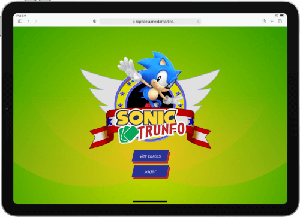
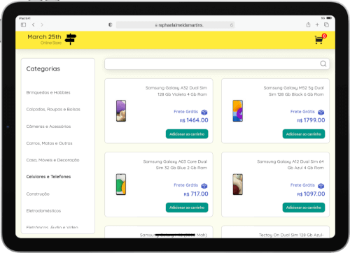

```JavaScript
const aboutMe = {
  name: 'Raphael Martins',
  age: '27 years old';
  level: 'Junior',
  tools: ['HTML', 'CSS', 'JavaScript ES6+', 'Sass', 'React', 'Redux', 'Sass', 'RTL'],
  softSkills: [
    'creativity',
    'leadership',
    'communication',
    'resilience',
    'emotional intelligence',
    'organization'
  ]
};

function contatcMe() {
  return 'Linkedin: https://www.linkedin.com/in/raphaelameidamartins/';
}
```

<br>

Jr. Web Development in the making. Currently, I am finishing the Front-end module of Trybe's course. I am a 27-year-old Brazilian who lives in São Paulo, Brazil. A nerd boy who loves technology, pop music, comic books, and games. I am a very creative person who likes to take on challenges and solve problems. Likewise, I am also dedicated and passionate about the things I do.

I know HTML, CSS, and modern JavaScript (ES6+). I can work with the React.js library, and now I am studying the Redux library. Also, know how to implement unit and integration automated tests with Jest and React Testing Library. Furthermore, I can work with Bash and the version control systems Git and GitHub.

When it comes to soft skills, I am sociable, empathic. I am always open to feedback. Finally, I understand agile methodologies such as Scrum and Kanban.

<br>
<br>

<div align="center">
  <a href="https://www.linkedin.com/in/raphaelameidamartins/" target="_blank" rel="external"></a>
  <a href="mailto:raphael.almeida.martins@gmail.com" target="_blank"></a> 
</div>
<br>

<h1 align="center">Projects</h1>

<table>
  <tr>
    <td valign="top">
      <h2 align="center"><a href="https://raphaelalmeidamartins.github.io/sonic-trumps/">Sonic Trumps</a></h2>
      
      <br>
      <br>
      <p><em><strong>Tools</strong>: React, Redux, React Router v6, HTML, CSS, Sass, JavaScript</em></p>
      <p>Top Trumps-style card game with Sonic the Hedgehog characters</p>
    </td>
    <td valign="top">
      <h2 align="center"><a href="https://raphaelalmeidamartins.github.io/trivia/">Trivia</a></h2>
      
      <br>
      <br>
      <p><em><strong>Tools:</strong> React, Redux, React Router v5, HTML, CSS, Sass, JavaScript, Agile</em></p>
      <p>Trivia game React application using a public API</p>
    </td>
  </tr>
  <tr>
    <td valign="top">
      <h2 align="center"><a href="https://raphaelalmeidamartins.github.io/front-end-online-store/#/">Online Store</a></h2>
      
      <br>
      <br>
      <p><em><strong>Tools:</strong> React, Context API, React Router v5, HTML, CSS, Sass, JavaScript, Agile</em></p>
      <p>Front-end Online Store SPA using a public API</p>
    </td>
    <td valign="top">
      <h2 align="center"><a href="https://raphaelalmeidamartins.github.io/trybewallet/">Wallet</a></h2>
      
      <br>
      <br>
      <p><em><strong>Tools:</strong> React, Redux, Redux thunk, HTML, CSS, Sass, Bulma, JavaScript</em></p>
      <p>Wallet application using exchange rates from a public API</p>
    </td>
  </tr>
</table>
<br>

<h2 align="center">GitHub Statistics</h2>

<div align="center">
  <a href="https://github.com/anuraghazra/github-readme-stats">
    
  </a>
  <a href="https://github.com/anuraghazra/github-readme-stats">
    
  </a>
  <a href="https://git.io/streak-stats">
    
  </a>
  <br>
  <br>
  <div>
    <p>Profile views since 11/21/2021:</p>
    <p></p>
  </div>
</div>
